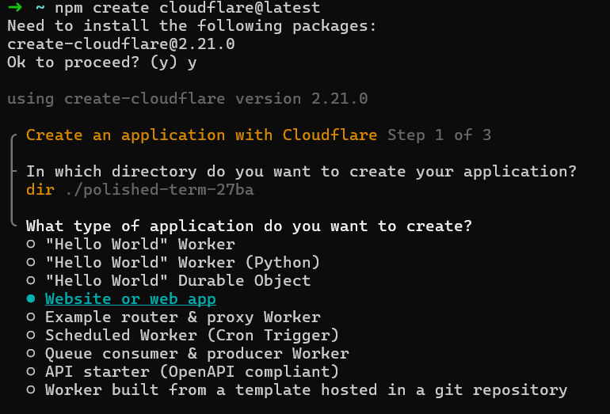
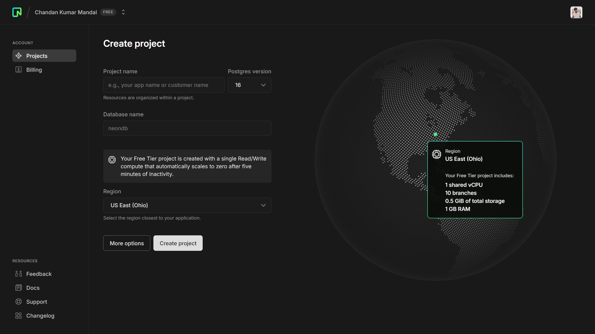
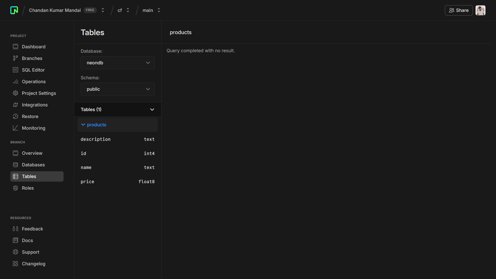
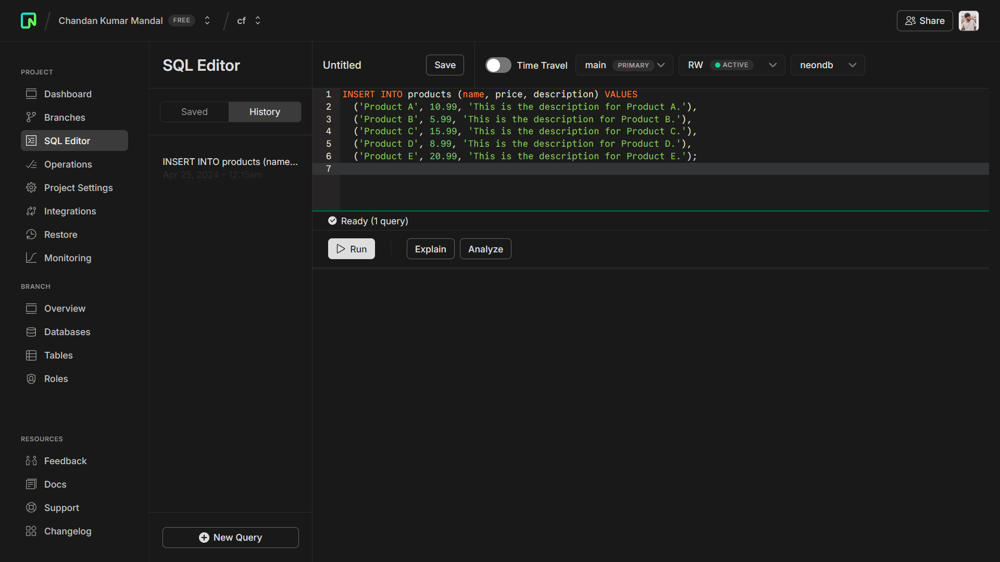
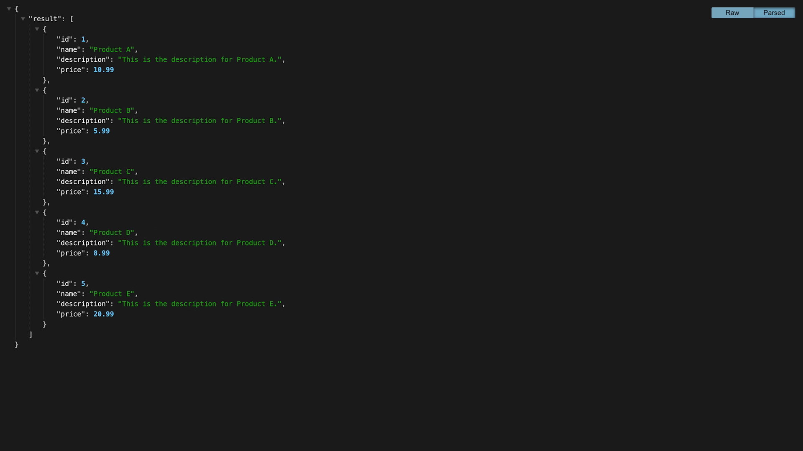
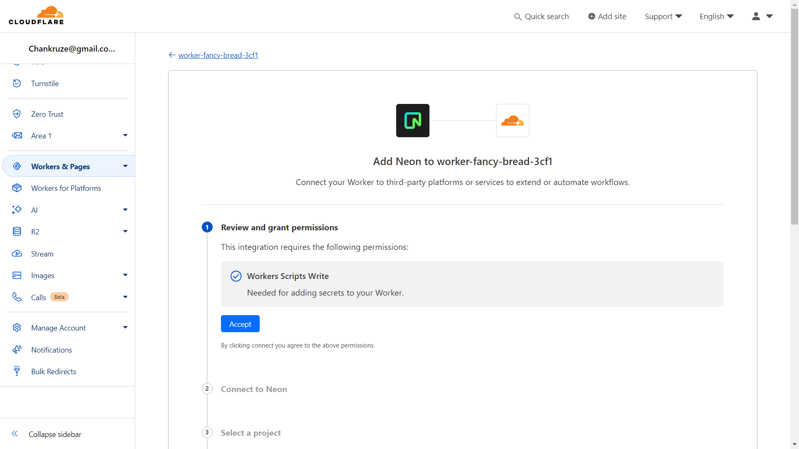

# Cloudflare Workers - Building a Serverless API using Drizzle ORM, Hono & Neon

## Prerequisites

To successfully complete this guide, you will need:

- [A Cloudflare account](https://dash.cloudflare.com/sign-up)
- [A Neon account](https://console.neon.tech)

## Overview

In this tutorial, you will learn how to use Cloudflare Workers, Hono, Drizzle ORM, and Neon to build a serverless API.

If you would like to review the code for this tutorial, the final version of the codebase is [available on GitHub](https://github.com/chankruze/cloudflare-drizzle-neon). You can take the code provided in the example repository, customize it, and deploy it for use in your own projects.

## 1. Set up the project using create-cloudflare-cli

First, use the [`create-cloudflare` CLI](/pages/get-started/c3) to create a new Cloudflare Workers project. To do this, open a terminal window and run the following command:

```sh
---
header: Create a new project with C3
---
$ npm create cloudflare@latest
```

To configure your Worker:

- Choose `Website or web app` for the type of application you would like to create.
- Choose `Hono` to `Which development framework do you want to use?`
- Answer `Yes` to `Do you want to use git for version control?`
- Answer `No` to `Do you want to deploy your application?`




Now wait for a bit to finish the setup. It should look similar to this:

```sh
➜  ~ npm create cloudflare@latest
Need to install the following packages:
create-cloudflare@2.21.0
Ok to proceed? (y) y

using create-cloudflare version 2.21.0

╭ Create an application with Cloudflare Step 1 of 3
│
├ In which directory do you want to create your application?
│ dir ./polished-term-27ba
│
├ What type of application do you want to create?
│ type Website or web app
│
├ Which development framework do you want to use?
│ framework Hono
│
├ Continue with Hono via `npx create-hono@0.7.0 polished-term-27ba --template cloudflare-workers --install --pm npm`
│

Need to install the following packages:
create-hono@0.7.0
Ok to proceed? (y) y
create-hono version 0.7.0
✔ Using target directory … polished-term-27ba
✔ Cloning the template
✔ Installing project dependencies
🎉 Copied project files
Get started with: cd polished-term-27ba

├ Copying template files
│ files copied to project directory
│
╰ Application created

╭ Configuring your application for Cloudflare Step 2 of 3
│
├ Installing @cloudflare/workers-types
│ installed via npm
│
├ Adding latest types to `tsconfig.json`
│ added @cloudflare/workers-types/2023-07-01
│
├ Retrieving current workerd compatibility date
│ compatibility date 2024-04-23
│
├ Updating `src/index.ts`
│ updated `src/index.ts`
│
├ Updating `package.json` scripts
│ updated `package.json`
│
├ Do you want to use git for version control?
│ yes git
│
├ Initializing git repo
│ initialized git
│
├ Committing new files
│ git commit
│
╰ Application configured

╭ Deploy with Cloudflare Step 3 of 3
│
├ Do you want to deploy your application?
│ no deploy via `npm run deploy`
│
├  APPLICATION CREATED  Deploy your application with npm run deploy
│
│ Navigate to the new directory cd polished-term-27ba
│ Run the development server npm run dev
│ Deploy your application npm run deploy
│ Read the documentation https://developers.cloudflare.com/workers
│ Stuck? Join us at https://discord.cloudflare.com
│
╰ See you again soon!

➜  ~
```

## 2. Set up Hono

To get started, run the following command in your project to add Hono as a dependency:

```sh
npm install hono
```

Next, go to your `src/index.ts` file and replace the existing code with the code provided below:

```js
---
filename: src/index.ts
---
import { Hono } from 'hono';

export type Env = {
  DATABASE_URL: string;
};

const app = new Hono<{ Bindings: Env }>();

app.get('/', (c) => {
  return c.json({
    message: 'Hello World!',
  });
});

export default app;
```

## 3. Create a Neon project

Go ahead and create an account if you do not have one already. Next, create a new project. Choose `16` as the Postgres version, pick the region closest to where you want to deploy your app and pick a size for your compute endpoint (you can change this later).



After you create the project, you get a connection string that you can use to connect to your database. In the root of your project, create a .dev.vars file and add the connection string as an environment variable. It should be formatted like a dotenv file, such as KEY=VALUE.

```text
---
filename: .dev.vars
---
DATABASE_URL="postgresql://<username>:<password>@ep-dry-violet-a5iayyaq.us-east-2.aws.neon.tech/neondb"
```

## 4. Add Drizzle ORM and Kit to your project

To add Drizzle to your project, run the following commands:

```sh
npm i drizzle-orm @neondatabase/serverless
npm i -D drizzle-kit postgres dotenv tsx
```

The first command installs `drizzle-orm` along with `@neondatabase/serverless`. This enables you to connect to Neon from serverless environments.

You are then installing `drizzle-kit` for generating migrations, `postgres.js` to establish a connection when running migrations, `dotenv` for loading environment variables, and `tsx` for executing TypeScript files.

## 5. Define the schema using TypeScript

In your src directory, create a new `db/schema.ts` file. This file will contain the database schema definition in TypeScript. Add the following code to the file you just created:

```ts
---
filename: db/schema.ts
---
import { pgTable, serial, text, doublePrecision } from 'drizzle-orm/pg-core';

export const products = pgTable('products', {
  id: serial('id').primaryKey(),
  name: text('name'),
  description: text('description'),
  price: doublePrecision('price'),
});
```

## 6. Generate database migrations

In the project’s root directory, create a `drizzle.config.ts` file and add the following code to it:

```ts
---
filename: drizzle.config.ts
---
import type { Config } from 'drizzle-kit';

export default {
  schema: './src/db/schema.ts',
  out: './drizzle',
} satisfies Config;
```

In this config file, you will specify the location of your schema as well as the output directory, which will contain the generated migrations. In our case, the output directory is called drizzle and will be located in the project’s root directory.

The next step is to generate the database migrations. To do that, modify your `package.json` file and add a new `db:generate` command in the scripts object:

```json
---
filename: package.json
---
"scripts": {
  ...
  "db:generate": "drizzle-kit generate:pg"
},
...
```

Now if you run the command npm run db:generate, you will see a newly generated SQL migration file in the `/drizzle` directory. The final step is to apply the migration to the database.

## 7. Apply migrations to the database

In your project’s root directory, create a `migrate.ts` file and add the following code to it:

```ts
---
filename: package.json
---
import { config } from 'dotenv';
import { migrate } from 'drizzle-orm/postgres-js/migrator';
import postgres from 'postgres';
import { drizzle } from 'drizzle-orm/postgres-js';

config({ path: '.dev.vars' });

const databaseUrl = drizzle(postgres(`${process.env.DATABASE_URL}`,
{ ssl: 'require', max: 1 }));

const main = async () => {
  try {
    await migrate(databaseUrl, { migrationsFolder: 'drizzle' });
    console.log('Migration complete');
  } catch (error) {
    console.log(error);
  }
  process.exit(0);
};

main();
```

Finally, to be able to execute this `migrate.ts` file, modify your package.json file and add a new `db:migrate` script in the scripts object:

```json
---
filename: package.json
---
...
"scripts": {
  ...
  "db:migrate": "tsx migrate.ts",
},
...
```

You can test it by running the following command, which applies the migration to your database:

```sh
npm run db:migrate
```

You can check that the tables have been created successfully by going to the “Tables” page in the Neon console.



## 8. Add data using Neon’s SQL editor

Right now, the products table you created is empty. In the Neon console, go to the SQL editor and run the following SQL query to add data to the products table.

```sql
INSERT INTO products (name, price, description) VALUES
  ('Product A', 10.99, 'This is the description for Product A.'),
  ('Product B', 5.99, 'This is the description for Product B.'),
  ('Product C', 15.99, 'This is the description for Product C.'),
  ('Product D', 8.99, 'This is the description for Product D.'),
  ('Product E', 20.99, 'This is the description for Product E.');
```



The next step is to connect to the database from the worker.

## 9. Connect to Neon from the worker

Navigate to your `src/index.ts` and add the following code:

```ts
---
filename: src/index.ts
---
import { drizzle } from 'drizzle-orm/neon-http';
import { neon } from '@neondatabase/serverless';
import { products } from './db/schema';
import { Hono } from 'hono';

export type Env = {
  DATABASE_URL: string;
};

const app = new Hono<{ Bindings: Env }>();

app.get('/', async (c) => {
  const sql = neon(c.env.DATABASE_URL);
  const db = drizzle(sql);
  const result = await db.select().from(products);
  return c.json({ result });
});

app.onError((error, c) => {
  console.log(error)
  return c.json({ error }, 400)
})

export default app;
```

Now, if you start your development server and go to `http://localhost:8787`, you will be able to see data being returned as JSON.



## 10. Deploy the worker using wrangler

To deploy your app, you must first log into your Cloudflare account. To do that, run `npx wrangler login`. You will be redirected to Cloudflare, where you can connect the CLI to your account.


Once logged in, you can run `npx wrangler deploy`, which deploys your worker. If you try to visit the deployed version, you will run into an error because you have not included the `DATABASE_URL` environment variable. To do that, you will leverage the Neon integration on Cloudflare.

```sh
---
header: Deploy your Worker project
---
$ npx wrangler deploy
```

## 11. Credential management using Cloudflare's Neon integration

Log into the Cloudflare dashboard, select “Workers & Pages” from the sidebar, and then “Overview”.

Next, choose the Worker you deployed, go to the “Settings” tab, choose “Integrations”, and select “Neon”. After accepting the terms, you will be redirected to an OAuth consent screen where you can authorize Cloudflare. Finally, select your project, branch, database, and role to finish setting up the integration.



Adding the integration automatically redeploys your worker. So now, when you visit the deployed worker, you will be able to see data returned from the database as JSON.

## Related resources

In this guide, you learned about Cloudflare workers, Hono, Drizzle ORM, Neon, and how you can use them together to create a serverless API.

If you want to get started building your own projects, review the existing list of [Quickstart templates](/workers/get-started/quickstarts/).
